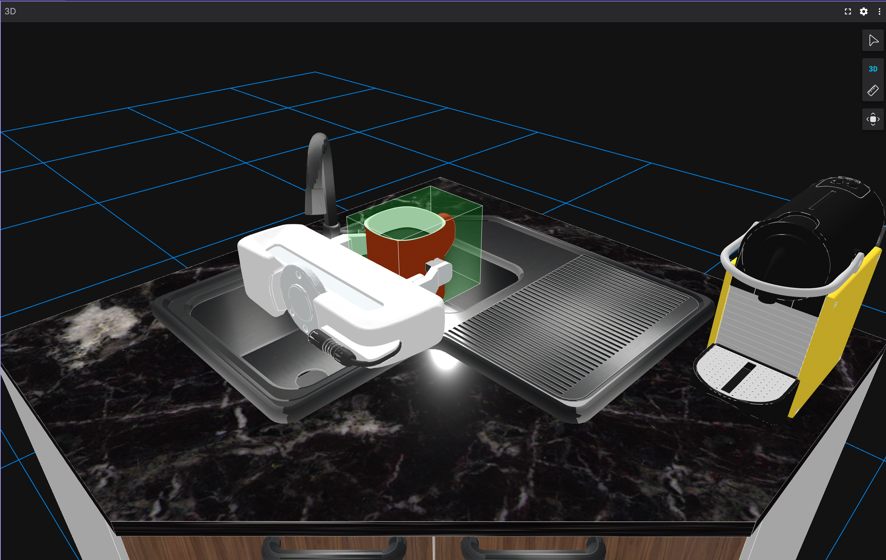
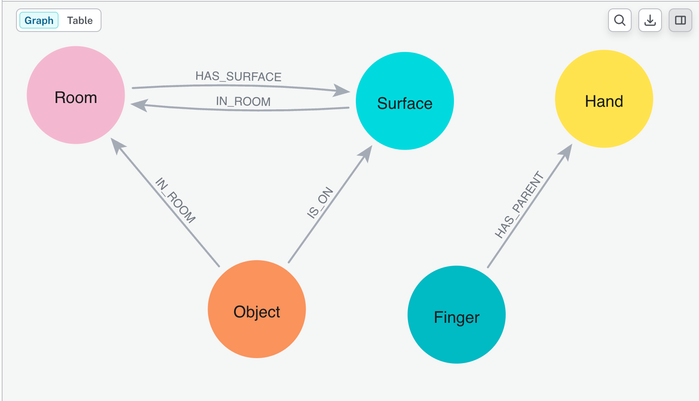
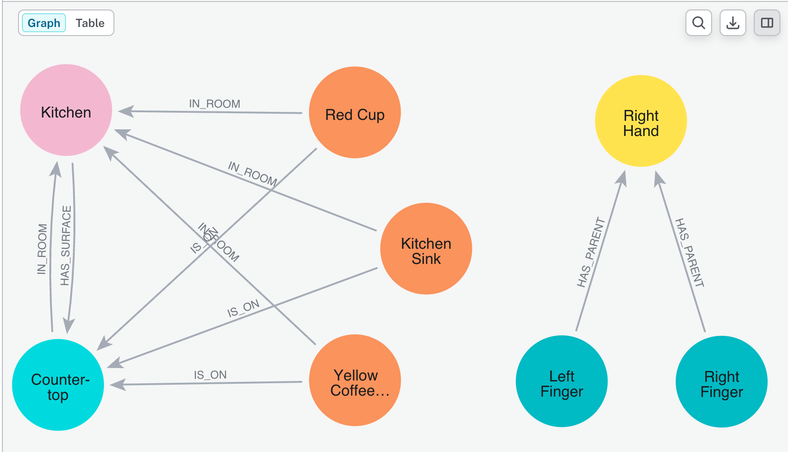
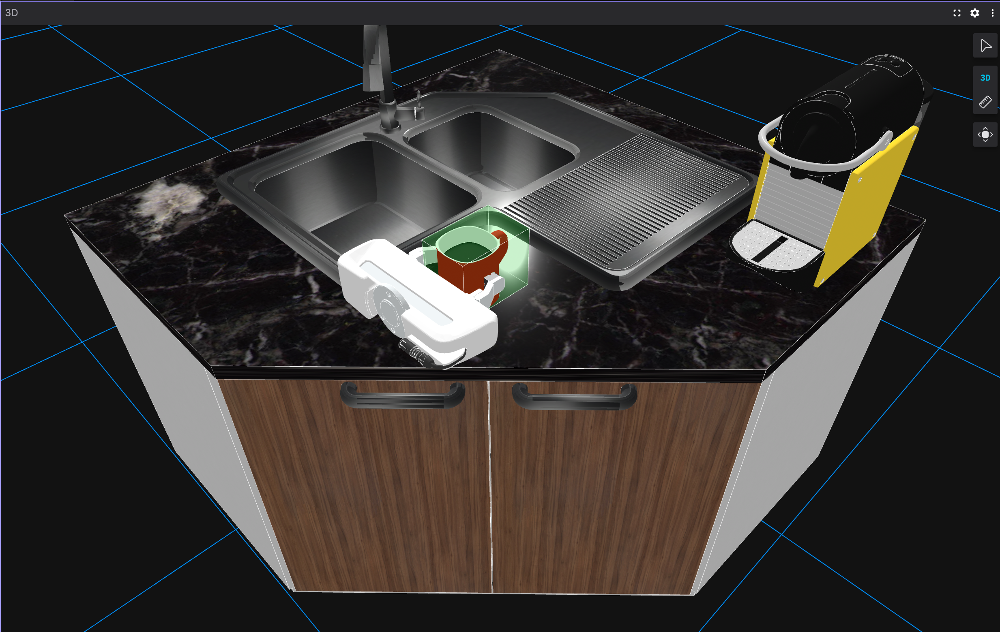
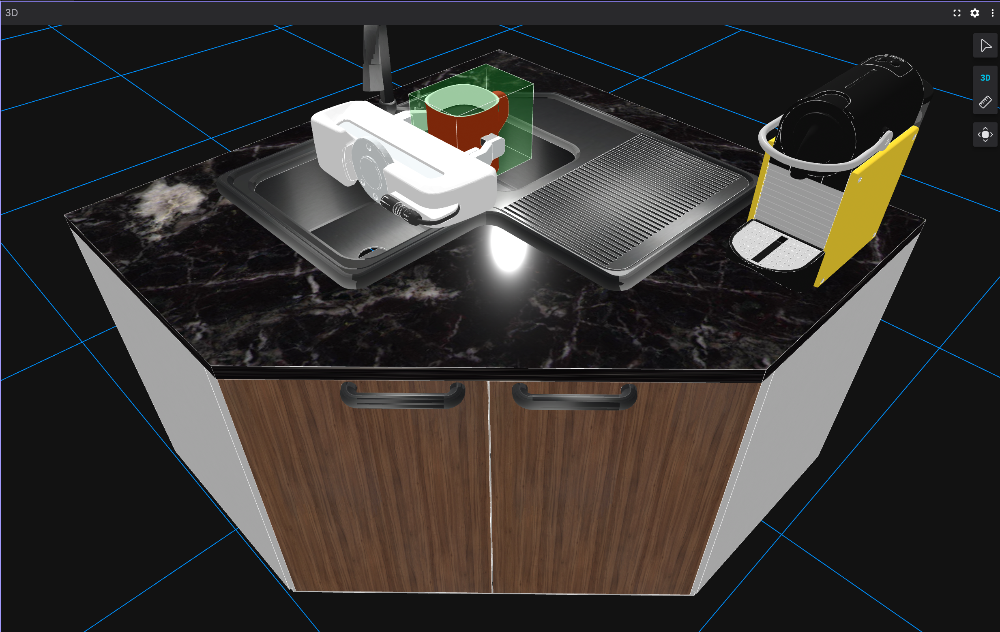
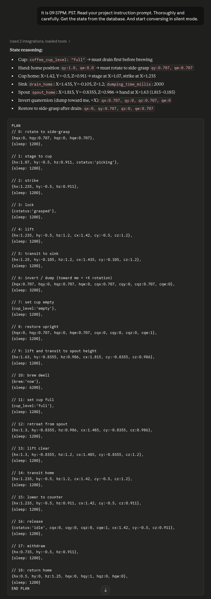

# Neo4j Semantic Robot

A proof-of-concept for **graph-backed humanoid robot control**: a Franka Emika robotic hand controlled by an LLM agent via Cypher queries against a live Neo4j knowledge graph, visualized in real time through Foxglove. Very, very simple.

---



## Why a Semantic Graph for a Humanoid?

A robot operating in a human environment doesn't just need to know *where things are* — it needs to understand *what things are, what they are named, what they can do, and what state they're in*.

Traditional robotics approaches rely on geometry: pose estimation, [SLAM](https://en.wikipedia.org/wiki/Simultaneous_localization_and_mapping), collision meshes, joint state. These are necessary but not sufficient. When a human says *"make me a coffee,"* the robot must traverse a chain of understanding that is fundamentally semantic:

- What is a coffee cup? Is it full or empty?
- Where is the coffee maker? What operation does it support?
- What physical sequence achieves "making coffee" given the current world state?
- What could go wrong, and what preconditions must be true first?

**The graph is the shared ontology between the human world and the robot world.** It encodes object identity, affordances, spatial relationships, and live physical state in a single queryable structure. The LLM agent reads this graph to answer semantic questions ("is the cup full?") and writes to it to drive physical actions ("move the hand here, set status to grasped").

This separates concerns cleanly:
- The **graph** holds world truth — positions, states, relationships, operation schemas
- The **agent** reasons in human terms against the graph, never against raw coordinates
- The **renderer** reacts to graph state — it is a pure consumer of world truth
- The **human** communicates intent in natural language; the agent maps it to graph operations

The result is a system where human intent flows naturally into physical action without the agent needing a hardcoded skill library. **The graph is the skill library** — every object node describes its own capabilities through its properties (`spout_home`, `brewing_time_seconds`, `drain_home`, `dumping_time_seconds`). The agent infers what operations are possible simply by reading the schema.

This pattern is likely to generalize far beyond this kitchen demo. Any humanoid robot working in human environments — kitchens, hospitals, warehouses, homes — will need a local semantic graph layer in its reasoning stack. Lidar shows you shapes. Geometry tells you where to put your hand. Semantics tell you what, why, in what order, and whether it is safe to do so. A graph running in the robot's local brain is what closes the loop between human language and humanoid action.

---

## Architecture

```
[Foxglove 3D Renderer]
        ↑
        | WebSocket SceneUpdate (ws://localhost:8765)
        |
[foxglove-server.py]  ←→  [Neo4j Digital Twin]  ←→  [neo4j-mcp]  ←→  [Claude Desktop]
  Franka kinematics           Semantic world model     MCP bridge        Kitchen assistant
  Linear interpolation        Nodes: Hand, Object,                       + Voice Mode MCP
  Finger animation            Finger, Surface, Room
  h.state writeback           Edges: IS_ON, IN_ROOM,
                              HAS_SURFACE, HAS_PARENT
```

**Data flow:**
1. Claude receives a natural language command (*"brew me a coffee"*)
2. Claude queries Neo4j via `neo4j-mcp` to read current world state
3. Claude reasons from graph properties, checks preconditions, plans a multi-phase action sequence
4. Claude writes Cypher transactions to update `Hand.location`, `Object.status`, etc.
5. `foxglove-server.py` reads the graph at ~67fps, interpolates hand movement, writes `h.state`
6. Claude polls `h.state` to detect arrival before issuing the next command
7. Foxglove renders the 3D scene live from the streamed `SceneUpdate` messages

---

## Graph Schema



### Node Types

| Label | Key Properties | Role |
|-------|---------------|------|
| `Hand` | `location`, `qx/qy/qz/qw`, `state`, `grip_z_offset` | Robotic hand — `state` owned by renderer |
| `Finger` | `side`, `local_offset_x/z`, `reference_fully_open`, `finger_tip_reach` | Gripper fingers — read-only |
| `Object` | `location`, `status`, `*_home`, `*_time_seconds`, `coffee_cup_level` | Interactive scene objects |
| `Surface` | `location`, `mesh_path`, `scale` | Static scene geometry |
| `Room` | `id`, `label` | Semantic container |

### Relationships

| Relationship | Meaning |
|-------------|---------|
| `IS_ON` | Object rests on Surface |
| `IN_ROOM` | Object or Surface is inside Room |
| `HAS_SURFACE` | Room owns a Surface |
| `HAS_PARENT` | Finger belongs to Hand (kinematic chain) |

### Object Capability Schema

Object nodes are self-describing. The agent infers available operations from node properties — the schema is the protocol:

| Property pattern | Meaning |
|-----------------|---------|
| `*_home` | Authoritative 3D approach position for that operation |
| `*_time_seconds` | Required dwell time after arrival |
| `last_*` | Timestamp to write on operation completion |
| `status` present | Requires full pick/grasp/release lifecycle |
| `status` absent | Time-gated only — arrival + dwell is the completion signal |
| `coffee_cup_level` | Fill state — must be read before any brew or drain operation |

---

## Components

### `foxglove-server.py`
The rendering engine and kinematic controller. Runs a tight loop (~67fps) that:
- Reads hand target position and orientation from Neo4j
- Linearly interpolates current position toward target (`LINEAR_STEP_POS = 0.04m/frame`)
- Slerp-interpolates rotation (`LINEAR_STEP_ROT = 0.12 rad/frame`)
- Animates gripper fingers based on cup proximity and grasp state
- Writes `h.state = 'arrived' | 'moving'` to Neo4j every frame
- Streams a `SceneUpdate` to Foxglove with all scene entities

### `claude-prompt.md`
The system prompt for the Claude Desktop project. Defines:
- Mandatory state-driven reasoning protocol (read → enumerate → preconditions → plan → act)
- 4-phase flight plan (Stage → Strike → Lock → Release)
- Calibrated rotation table (empirically verified quaternion compositions)
- Coffee brew and drain operation protocols
- Kinematic constants derived from live finger and object node properties

### `load-digital-twin.cyp`
An APOC-generated Cypher snapshot of the full DB state. Restores a known-good world configuration including all nodes, properties, and relationships.

---

## Getting Started

### Prerequisites

- **[Neo4j](https://neo4j.com/download/)** — local or Aura cloud instance
- **[neo4j-mcp](https://github.com/neo4j-contrib/mcp-neo4j)** — install the released binary locally
- **[Foxglove](https://foxglove.dev)** — 3D visualization desktop app
- **[franka_description](https://github.com/frankaemika/franka_description)** — clone anywhere on your machine; Foxglove resolves `package://` URIs from it
- **Python 3.10+**
- **Claude Desktop** with MCP support

### Install Python Dependencies

```bash
pip install foxglove-sdk neo4j python-dotenv scipy numpy
```

### Environment Variables

```bash
cp .env_example .env
```

Edit `.env`:

```env
NEO4J_URI=bolt://localhost:7687
NEO4J_USER=neo4j
NEO4J_PASSWORD=your-password-here
PATH_TO_REPO="file:///path/to/your/GitHub/"
```

`PATH_TO_REPO` must end with `/` and use the `file://` prefix. It is prepended to relative `mesh_path` values stored on graph nodes.

### Load the Digital Twin

In Neo4j Browser, run `load-digital-twin.cyp` to initialize the world state. Each statement must run sequentially (the APOC import constraint must be created before nodes, dropped after cleanup).

```
MATCH path = (n)--() RETURN path
```




### Configure Claude Desktop

Add to `claude_desktop_config.json` (typically `~/Library/Application Support/Claude/`):

```json
{
  "mcpServers": {
    "neo4j-mcp": {
      "command": "neo4j-mcp",
      "args": [],
      "env": {
        "NEO4J_URI": "bolt://localhost:7687",
        "NEO4J_USERNAME": "neo4j",
        "NEO4J_PASSWORD": "your-password-here",
        "NEO4J_DATABASE": "neo4j",
        "NEO4J_READ_ONLY": "false",
        "NEO4J_TELEMETRY": "false",
        "NEO4J_LOG_LEVEL": "info",
        "NEO4J_LOG_FORMAT": "text",
        "NEO4J_SCHEMA_SAMPLE_SIZE": "100"
      }
    },
    "voice-mode": {
      "command": "uvx",
      "args": ["voice-mode"],
      "env": {
        "OPENAI_API_KEY": "your-openai-key"
      }
    }
  }
}
```

Create a Claude Desktop **Project**, paste in the contents of `claude-prompt.md` as the system prompt, and restart Claude.

> **Voice Mode + ports:** When using Voice Mode with the OpenAI TTS backend (cloud), there is no port conflict — Voice Mode uses only the OpenAI API and does not open a local server. If you switch to a local TTS engine, check whether it binds port 8765 and resolve the conflict before starting `foxglove-server.py`.

### Run

```bash
python foxglove-server.py
```

Open Foxglove → **New Connection** → **WebSocket** → `ws://localhost:8765`

**Configure Franka meshes:** Foxglove resolves `package://franka_description/...` URIs from a local directory. Go to **Foxglove → Settings → Desktop** and set the ROS package path to the parent directory containing your `franka_description` clone (e.g. `/Users/yourname/GitHub/`).

---

## Example Commands

| | |
|---|---|
|  |  |


Start a session with:

> *"Let's converse, I'm in PST — read your project instructions carefully and get the state from the DB."*

Then try natural language queries and robot commands:

```
"where's my coffee cup?"
"how old is my coffee?"
"what's in the room?"
"brew me a new cup"
```

Explicit robot control:

```
"move up 1 meter"
"grab the cup, lift it and turn it toward me"
```

Reset everything:

```
"place the cup at home, return to home and reset"
```

---

## Resources

- [Neo4j GenAI Ecosystem](https://neo4j.com/labs/genai-ecosystem/) — MCP servers, integrations, and tools for building AI applications on Neo4j

---

## Extending the Scene

Add a new interactive object by creating a node in Neo4j:

```cypher
CREATE (obj:Object {
  id: "toaster",
  label: "Toaster",
  location: point({x: 1.6, y: -0.4, z: 0.911, crs: 'cartesian-3d'}),
  home: point({x: 1.6, y: -0.4, z: 0.911, crs: 'cartesian-3d'}),
  status: "idle",
  mesh_path: "neo4j-semantic-robot/meshes/toaster/toaster.obj",
  scale: 0.01,
  qx: 0, qy: 0, qz: 0, qw: 1.0
})
```

Wire it to the scene:

```cypher
MATCH (obj:Object {id: "toaster"}), (s:Surface {id: "countertop"}), (r:Room {id: "rm_001"})
CREATE (obj)-[:IS_ON]->(s)
CREATE (obj)-[:IN_ROOM]->(r)
```

The renderer picks it up automatically on the next frame. The agent discovers it by querying the graph. No code changes required.

---

## Exporting a DB Snapshot

**Local Neo4j:** APOC export writes a restorable Cypher file directly. Enable it in `apoc.conf`:

```ini
apoc.export.file.enabled=true
apoc.import.file.use_neo4j_config=false
```

Then run in Neo4j Browser:

```cypher
CALL apoc.export.cypher.all("load-digital-twin.cyp", {
    format: "plain",
    cypherFormat: "create",
    writeNodeProperties: "true"
})
```

**Aura:** APOC file export is not available. Use the Aura console to take a snapshot (backup), or export via `apoc.export.cypher.all` to a string and copy the output manually.

---

## Meshes

| Path | Object |
|------|--------|
| `meshes/red-coffee-cup/` | Red coffee cup (`.obj`) |
| `meshes/coffee-maker/` | Yellow coffee maker (`.obj`) |
| `meshes/kitchen-counter/` | Kitchen countertop (`.obj`) |

Franka hand and finger meshes (`hand.dae`, `finger.dae`) are loaded via `package://franka_description/meshes/robot_ee/franka_hand_white/visual/`. Foxglove resolves this URI using the ROS package path configured in Settings → Desktop.

---

## Key Design Decisions

**Why Neo4j?** Property graphs naturally model object identity, spatial relationships, and affordances. Cypher is expressive enough for an LLM to write correctly and readable enough to debug in Neo4j Browser.

**Why not write finger state from the agent?** The renderer owns all animation state derived from physics. Fingers animate from a single `curr_f_prog` float computed from cup proximity and grasp status. Writing finger positions from the agent would create race conditions and fight the renderer.

**Why poll `h.state` instead of sleeping?** The agent cannot know how far the hand has to travel. Polling against `h.state = 'arrived'` makes the protocol distance-independent and correct for any target.

**Why separate queries for fingers vs. scene objects?** Joining `OPTIONAL MATCH (extra:Object)` with `OPTIONAL MATCH (f:Finger)` in a single query produces a Cartesian product, multiplying `env_objects` by the number of fingers. Keep them as separate queries.

